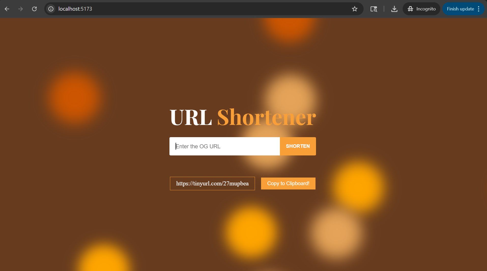

This project was bootstrapped with [Vite](https://vitejs.dev/), a fast frontend build tool optimized for modern web development.

In the project directory, you can run:

### `pnpm install`

Instal All dependencies in this project

### `pnpm run dev`

Runs the app in the development mode. 

Open [http://localhost:5173/](http://localhost:5173/) OR [http://localhost:3000](http://localhost:3000) to view it in the browser.

### Link

Reactjs: https://reactjs.org/docs/create-a-new-react-app.html
Shortener Api: https://tinyurl.com/
font family: https://fonts.google.com/specimen/Playfair+Display
background animation: https://wweb.dev/resources/animated-css-background-generator/
react-copy-to-clipboard: https://www.npmjs.com/package/react-copy-to-clipboard
